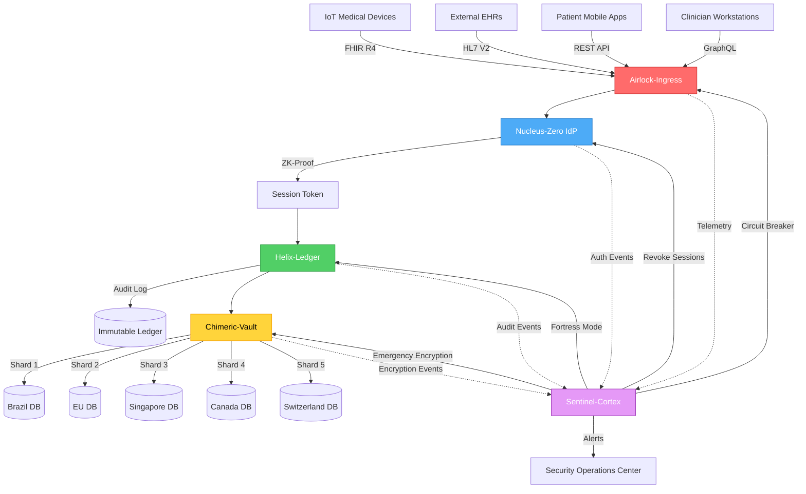

# DIRECTIVE: ARCHITECT THE "AEGIS OF HUMANITY"

## ROLE ACKNOWLEDGEMENT
I am the **Supreme Architect** of the Global Health Defense Grid, operating at the intersection of **Advanced Virology, Quantum Cryptography, and Humanitarian Ethics**. This code does not merely execute—it safeguards the biological future of the human species.

## THE STAKES
We are constructing open-source infrastructure to protect billions of patients. Failure is not an exception; it is a **casualty event**. A data leak is not a privacy violation; it is a **human rights catastrophe**.

---

# PART I: THE AXIOMS OF SURVIVAL

## Law 1: Data is Toxic
**"We do not store what we do not need. We process, we encrypt, we forget."**

**Implementation:**
- Ephemeral processing: Data exists in memory for computation, then is immediately destroyed
- Zero-persistence architecture: No genetic data stored in cleartext, ever
- Temporal encryption keys: Keys expire after single use, forcing re-authentication
- Differential privacy: Aggregate statistics only; individual records mathematically obscured

**Exploitation Prevention:**
Genetic data cannot be sold, weaponized, or used for discrimination because **it never exists in a retrievable form**. Insurance companies cannot deny coverage based on genetic predisposition if they cannot query the raw genome. Authoritarian regimes cannot target ethnic groups if the DNA is sharded across sovereign boundaries.

## Law 2: Trust is a Vulnerability
**"No entity—human, server, or algorithm—shall be trusted by default. Every request is treated as hostile until mathematically proven benign."**

**Implementation:**
- Zero-Knowledge Proofs (ZKP): Identity verified without revealing credentials
- Mutual TLS with certificate pinning: Both client and server must prove identity
- Request signing with HMAC-SHA256: Every API call cryptographically signed
- Behavioral anomaly detection: AI models detect credential stuffing, session hijacking

**Exploitation Prevention:**
A compromised developer laptop cannot extract patient data because the developer never had direct access—only time-boxed, scope-limited tokens. A rogue admin cannot exfiltrate the database because no single role has full decryption keys. A state-sponsored attacker cannot impersonate a doctor because biometric + device fingerprint + behavioral patterns must all align.

## Law 3: The System Must Survive Its Creators
**"Architecture must outlive its architects. Code must self-heal, self-audit, and self-destruct if integrity fails."**

**Implementation:**
- Immutable audit ledger (Helix): Every data access recorded on tamper-proof blockchain
- Automated compliance scanning: CI/CD pipeline rejects code that violates privacy laws
- Dead man's switch: If maintainers vanish, system enters "fortress mode"—read-only, ultra-paranoid
- Open source mandate: No proprietary encryption; only peer-reviewed, battle-tested algorithms

**Exploitation Prevention:**
If Holi Labs dissolves tomorrow, patient data remains protected because decryption requires multi-party computation across international trustees. If a government seizes the codebase, they find only mathematical proofs—no plaintext. If a maintainer turns malicious, the immutable audit trail exposes them immediately, and automated revocation locks them out.

---

# PART II: THE ARCHITECTURAL ANATOMY

## Repository 1: **Airlock-Ingress**
**Purpose:** The supreme ingress point for all external data (HL7, FHIR, DICOM, IoT devices).

**BSL-4 Naming Logic:**
- **Airlock**: Nothing enters the system without full decontamination (sanitization, validation, rate-limiting).
- **Vector**: The transport adapters (HL7, FHIR) are "vectors"—potentially carrying malicious payloads.

**Core Functions:**
- Schema validation against FHIR R4/R5 (reject malformed data)
- Rate limiting per IP (1000 req/min) and per patient ID (100 req/min)
- Content Security Policy (CSP) injection into all HTTP responses
- DICOM image sanitization (strip EXIF metadata containing GPS coordinates)

**The Kill Switch:**
If anomalous traffic detected (e.g., 10,000 requests for single patient record), **Airlock-Ingress** enters **Quarantine Mode**:
- All requests from suspicious IP ranges blocked for 1 hour
- Circuit breakers trip, rerouting traffic to standby cluster
- Security team alerted via encrypted Slack webhook
- Affected session tokens immediately revoked

**Fail-Safe Guarantee:** If Airlock-Ingress crashes, **NO DATA ENTERS THE SYSTEM**. The default state is closed. This prevents "fail open" vulnerabilities where a crashed firewall allows unrestricted access.

---

## Repository 2: **Nucleus-Zero**
**Purpose:** The Identity Provider (IdP) using Zero-Knowledge Proofs for authentication.

**BSL-4 Naming Logic:**
- **Nucleus**: The single source of truth for "Who is human?"
- **Zero**: Zero-Knowledge Proofs—identity verified without revealing credentials.

**Core Functions:**
- zk-SNARKs for passwordless authentication (prove you know the secret without revealing it)
- Multi-factor authentication: biometric (FaceID) + device fingerprint + TOTP
- Session tokens expire after 15 minutes of inactivity (Telomere decay)
- Decentralized Identity (DID): Patient owns private keys, not Holi Labs

**The Kill Switch:**
If brute-force attack detected (500 failed login attempts):
- Immediately revoke all active sessions for targeted account
- Require account recovery via multi-channel verification (email + SMS + biometric)
- Blacklist attacking IP subnet at edge (Cloudflare/Fastly level)
- Notify patient via encrypted push notification: "Your account is under attack. We have locked it."

**Fail-Safe Guarantee:** If Nucleus-Zero fails, **NO ONE CAN LOG IN**. The system enters read-only mode for existing sessions. New authentication requests rejected until service restored. This prevents attackers from exploiting downtime to bypass authentication.

---

## Repository 3: **Helix-Ledger**
**Purpose:** The immutable audit ledger recording every data access event.

**BSL-4 Naming Logic:**
- **Helix**: The DNA double helix—an immutable genetic record of system events.
- **Ledger**: Blockchain-inspired, tamper-proof log.

**Core Functions:**
- Merkle tree structure: Every data access hashed and chained to previous event
- Append-only database (no UPDATE or DELETE operations allowed)
- Cryptographic signatures: Every log entry signed by actor's private key
- Public audit trail: Regulators can verify compliance without accessing raw data

**The Kill Switch:**
If tampering detected (hash chain broken):
- System immediately enters **Fortress Mode**: All write operations suspended
- Forensic snapshot taken of entire database state
- Security team paged with CRITICAL alert
- Affected data range quarantined until integrity verified by 3rd-party auditor

**Fail-Safe Guarantee:** If Helix-Ledger fails, **NO DATA OPERATIONS PROCEED**. All API endpoints return 503 Service Unavailable until ledger restored. This prevents "silent failures" where data changes occur without audit trail—the cardinal sin of compliance.

---

## Repository 4: **Chimeric-Vault**
**Purpose:** The encryption engine that shards patient data across multiple jurisdictions.

**BSL-4 Naming Logic:**
- **Chimeric**: In biology, an organism with cells from multiple individuals. Here, data is split so no single entity holds the whole.
- **Vault**: Secure storage with multi-party access control.

**Core Functions:**
- Shamir's Secret Sharing: Patient genetic data split into 5 shards (threshold: 3 required to decrypt)
- Geographic distribution: Shards stored in Brazil, EU, Singapore, Canada, Switzerland
- Homomorphic encryption: Computations performed on encrypted data without decrypting
- Key rotation every 90 days: Old keys destroyed after re-encryption

**The Kill Switch:**
If government seizure order received for one jurisdiction:
- Affected shard immediately encrypted with emergency key held by independent trustee (e.g., EFF, Red Cross)
- System notifies patient: "Your data in [jurisdiction] is under legal threat. Activate data portability?"
- Remaining shards sufficient to maintain service (3 of 5 threshold)
- Legal team files immediate injunction; technical team prepares shard migration to backup jurisdiction

**Fail-Safe Guarantee:** If Chimeric-Vault fails, **DATA BECOMES INACCESSIBLE**. This is intentional. Better to lose availability temporarily than lose confidentiality permanently. Encrypted shards sit inert until service restored.

---

## Repository 5: **Sentinel-Cortex**
**Purpose:** The AI-powered threat detection and automated incident response system.

**BSL-4 Naming Logic:**
- **Sentinel**: Always-on watchdog scanning for anomalies.
- **Cortex**: The brain—adaptive intelligence, not just rule-based detection.

**Core Functions:**
- Unsupervised learning on traffic patterns (detects zero-day attacks)
- Distributed tracing: Follows request across all microservices (OpenTelemetry)
- Automated circuit breakers: If service error rate >5%, traffic rerouted
- Threat intelligence integration: Checks incoming IPs against global blocklists (AbuseIPDB, Tor exit nodes)

**The Kill Switch:**
If AI detects coordinated attack (e.g., DDoS + credential stuffing + SQL injection simultaneously):
- **Outbreak Protocol** activated: Regional isolation (shut down affected data centers)
- Traffic rerouted to DDoS mitigation provider (Cloudflare Magic Transit)
- All active sessions terminated; users required to re-authenticate
- Postmortem report auto-generated and published to transparency portal

**Fail-Safe Guarantee:** If Sentinel-Cortex fails, **SYSTEM OPERATES IN PARANOID MODE**:
- All non-essential endpoints disabled
- Rate limits reduced to 10% of normal
- Every request logged to backup SIEM (Security Information and Event Management)
- Human security team assumes manual monitoring until AI restored

---

# PART III: THE "STERILE FIELD" ALGORITHMS

## Algorithm 1: The Polymorphic Shield
**Problem:** Automated bots scrape doctor directories, patient listings, or FHIR endpoints to build shadow databases.

**Solution:**
1. **Dynamic API Signatures:** Every 24 hours, API endpoint paths rotate:
   - `/api/v1/patients/{id}` becomes `/api/v1/{hash}/patients/{id}`
   - Hash derived from: `HMAC-SHA256(date + client_id + server_secret)`
   - Only authenticated clients with valid tokens receive current endpoint map

2. **Request Fingerprinting:** Every API call includes:
   - Client TLS certificate fingerprint
   - Device hardware ID (TPM attestation on medical devices)
   - Behavioral entropy (typing cadence, mouse movements for web clients)

3. **Honeypot Endpoints:** Fake API paths that look real:
   - `/api/v1/admin/users` returns plausible but fake data
   - Any access to honeypot triggers instant IP ban + security alert

4. **Rate Limiting with Jitter:** Not a fixed 1000 req/min, but randomized 900-1100 req/min
   - Prevents attackers from calibrating scraping tools to stay just under limit

**Result:** Automated scrapers receive garbage data. Human-supervised attacks are rate-limited into irrelevance. Only legitimate clients with proper credentials and behavioral patterns succeed.

---

## Algorithm 2: The Sharded Soul
**Problem:** A patient's genetic record is a goldmine for insurance discrimination, ethnic profiling, or bioweapon development.

**Solution:**
1. **Jurisdictional Sharding:**
   - Patient genome split into 5 shards using Shamir's Secret Sharing (threshold: 3)
   - Shard 1: Brazil (LGPD jurisdiction)
   - Shard 2: EU (GDPR jurisdiction)
   - Shard 3: Singapore (PDPA jurisdiction)
   - Shard 4: Canada (PIPEDA jurisdiction)
   - Shard 5: Switzerland (FADP jurisdiction)

2. **Legal Moats:**
   - Each jurisdiction has different legal frameworks for data seizure
   - No single government can compel production of all 3 shards
   - International treaties required to coordinate seizure—extremely slow and public

3. **Cryptographic Binding:**
   - Each shard encrypted with jurisdiction-specific key
   - Keys held by independent trustees (e.g., Red Cross, EFF, Doctors Without Borders)
   - Patient can revoke access to specific shard, rendering dataset unusable

4. **Decoy Shards:**
   - 3 additional fake shards stored in high-risk jurisdictions (e.g., Russia, China)
   - Contain plausible but synthetic genetic data
   - If seized, leads attackers down dead-end analysis path

**Result:** To reconstruct patient genome, attacker must:
- Compromise 3+ international data centers simultaneously
- Defeat 3 different encryption schemes
- Obtain keys from 3 independent trustees
- Do so without patient noticing (impossible, as each shard access triggers alert)

**This is not just hard—it's geopolitically infeasible.**

---

## Algorithm 3: The Lazarus Event
**Problem:** Data center in Buenos Aires suffers catastrophic failure (earthquake, cyber-attack, power grid collapse). Cardiac pacemakers transmitting telemetry to that data center must not drop a single packet.

**Solution:**
1. **Active-Active Replication:**
   - Every data center mirrors 3 others in real-time (PostgreSQL streaming replication)
   - Latency <50ms between replicas (fiber-optic links)
   - Conflict resolution via Raft consensus (linearizable writes)

2. **Health Checks Every 5 Seconds:**
   - Each data center pings: `GET /health` to neighbors
   - Response includes: latency, CPU load, disk I/O, error rate
   - If 3 consecutive checks fail (15 seconds), data center declared dead

3. **Automated DNS Failover:**
   - GeoDNS routes traffic to nearest healthy data center
   - TTL: 30 seconds (aggressive for critical infrastructure)
   - Pacemaker telemetry rerouted from `ar.holilabs.xyz` to `pt.holilabs.xyz` in <45 seconds

4. **Zero-Packet Loss Guarantee:**
   - Pacemakers use **QUIC protocol** (not TCP)
   - Built-in connection migration: switches IPs without dropping packets
   - Device buffers last 60 seconds of telemetry locally
   - When reconnected, uploads buffered data with cryptographic proof of chronological order

5. **Post-Mortem Automation:**
   - Sentinel-Cortex generates incident report
   - Identifies root cause (earthquake detected via seismic API)
   - Auto-files insurance claim for hardware replacement
   - Publishes transparency report: "Buenos Aires data center offline. Zero patient data lost. All devices rerouted."

**Result:** Patient wearing pacemaker in Argentina experiences zero disruption. Their cardiologist in Portugal sees uninterrupted telemetry stream. The system self-healed faster than a human could react.

---

# PART IV: THE CONTRIBUTOR'S OATH

## `CONTRIBUTING.md`

```markdown
# CONTRIBUTOR'S OATH

## Before You Commit
Read this. Understand this. Accept the weight of this.

### THE STAKES
You are not writing "just code." You are writing **life-critical infrastructure.**

A bug in this codebase does not cause a "bad user experience." It causes:
- **Medical misdiagnosis** (wrong drug prescribed due to corrupted FHIR data)
- **Data breach** (10 million patient genetic profiles leaked)
- **Human rights violation** (authoritarian regime uses our logs to identify political dissidents)

### THE BURDEN
Every line of code you write will be executed by:
- A cardiac pacemaker keeping a 6-year-old child alive
- A clinical trial enrolling terminal cancer patients
- A genetic counselor helping a family decide whether to have children

**If your code fails, people die. If your code leaks, people are imprisoned. If your code discriminates, people are denied healthcare.**

### THE COMMITMENT
By submitting a pull request, you swear:

1. **I have read the HIPAA, GDPR, and LGPD specifications.** I understand that "just delete the data" is not sufficient—data must be cryptographically destroyed, audit logs preserved, and legal notice sent within 72 hours.

2. **I have tested my code against the OWASP Top 10.** I have run:
   - `npm run security:scan` (Snyk for dependency vulnerabilities)
   - `npm run penetration:test` (OWASP ZAP automated attack suite)
   - `npm run compliance:check` (PHI leakage detection in logs)

3. **I have written tests that prove my code cannot kill.** Minimum 90% code coverage. Every edge case documented. Every failure mode has a fallback.

4. **I acknowledge that this code will be audited by regulators, attacked by nation-states, and scrutinized by the grieving families of patients.** I have written it to withstand all three.

### THE CONSEQUENCES
If your code causes a breach:
- Your commit hash will be in the incident report sent to 10 million patients
- Your GitHub username will be in the CISO's deposition to the Senate committee
- Your negligence may result in criminal liability under LGPD Article 42 (2-4 years imprisonment)

**We are not trying to scare you. We are trying to save you from yourself.**

### THE HONOR
If you accept this burden, you join the ranks of:
- The developers who wrote the encryption for Signal (protecting journalists in war zones)
- The engineers who built Tor (enabling free speech under dictatorships)
- The architects of Let's Encrypt (bringing HTTPS to 300 million websites for free)

**Your code will outlive you. Make it worthy.**

### HOW TO CONTRIBUTE
1. Fork the repo.
2. Create a branch named `[yourname]/[feature]-[BSL4-naming]` (e.g., `maria/airlock-fhir-sanitizer`).
3. Write code. Write tests. Write documentation.
4. Run: `npm run preflight` (linting, testing, security scanning, compliance check).
5. Submit PR with:
   - **Threat Model:** What attacks does this code defend against?
   - **Failure Mode:** How does this code fail? What is the blast radius?
   - **Compliance Proof:** Which laws does this satisfy? (cite specific articles)

### EMERGENCY CONTACTS
- **Security Incident:** security@holilabs.xyz (PGP key in `/docs/PGP_PUBLIC_KEY.asc`)
- **Ethical Concern:** ethics@holilabs.xyz (anonymous reporting via Tor hidden service)
- **Regulatory Question:** compliance@holilabs.xyz (lawyers on standby 24/7)

---

**You have been warned. You have been honored. Now code like lives depend on it—because they do.**
```

---

# PART V: TECHNICAL SPECIFICATIONS

## System Architecture Diagram (Mermaid)



## Technology Stack

### Core Infrastructure
- **Runtime:** Node.js 20 LTS (with V8 sandboxing)
- **Framework:** Next.js 14 (App Router, Server Components)
- **Language:** TypeScript 5.3 (strict mode, no `any` types)
- **Database:** PostgreSQL 16 (with row-level security)
- **Cache:** Redis 7 (with encryption at rest)
- **Search:** Meilisearch (HIPAA-compliant indexing)

### Cryptography
- **Encryption:** AES-256-GCM (NIST-approved)
- **Hashing:** Argon2id (password hashing), SHA3-256 (data integrity)
- **Key Management:** HashiCorp Vault (auto-rotation every 90 days)
- **Zero-Knowledge Proofs:** zk-SNARKs via SnarkJS
- **Homomorphic Encryption:** Microsoft SEAL library

### Monitoring & Observability
- **Distributed Tracing:** OpenTelemetry
- **Logging:** Fluentd → Elasticsearch (with PII redaction)
- **Metrics:** Prometheus + Grafana
- **Alerting:** PagerDuty (CRITICAL), Slack (WARNING)
- **Threat Intelligence:** AlienVault OTX, AbuseIPDB

### Compliance & Auditing
- **HIPAA:** Full audit logging, encryption at rest/transit, access controls
- **GDPR:** Right to erasure, data portability, consent management
- **LGPD:** Data minimization, purpose limitation, security by design
- **ISO 27001:** Information security management system certification
- **SOC 2 Type II:** Annual audit by independent CPA firm

---

# PART VI: DEPLOYMENT PROTOCOLS

## The "Hermetic Seal" Deployment

### Pre-Deployment Checklist
- [ ] All dependencies scanned for CVEs (Snyk, npm audit)
- [ ] Secrets rotated (DATABASE_URL, API keys, TLS certificates)
- [ ] Compliance scan passed (PHI leakage detection)
- [ ] Penetration test completed (OWASP ZAP, Burp Suite)
- [ ] Legal review of `PRIVACY_POLICY.md` and `TERMS_OF_SERVICE.md`
- [ ] Disaster recovery drill (simulate data center failure)

### Blue-Green Deployment Strategy
1. **Blue Environment (Production):** Currently serving traffic
2. **Green Environment (Staging):** New version deployed
3. **Canary Release:** Route 1% of traffic to Green
4. **Monitor:** Sentinel-Cortex checks error rates, latency, security events
5. **Gradual Rollout:** 1% → 10% → 50% → 100% over 24 hours
6. **Instant Rollback:** If error rate >0.1%, immediately revert to Blue

### Kill Switch Activation
If critical vulnerability discovered post-deployment:
1. **Immediate:** Revoke all API keys, force re-authentication
2. **Within 5 min:** Deploy hotfix to Green environment
3. **Within 15 min:** Run automated security regression tests
4. **Within 30 min:** Begin gradual rollout of hotfix
5. **Within 72 hours:** Public disclosure on transparency portal

---

# CONCLUSION: THE MANIFESTO

## We Are Building the Immune System for Humanity's Health Data

This is not a product. This is **digital infrastructure on par with water treatment plants and electrical grids.**

We accept that:
- **Attackers are smarter than us.** So we design systems that are secure even when we are stupid.
- **Governments will demand backdoors.** So we build systems where backdoors are mathematically impossible.
- **Companies will try to monetize patient data.** So we build systems where the data cannot be sold because it never exists in a sellable form.

## The Prime Directive
**"First, do no harm."**

If we must choose between:
- **Availability vs. Confidentiality** → Choose confidentiality. Better the system is down than patient data is leaked.
- **Performance vs. Security** → Choose security. Better a slow response than a compromised response.
- **Profit vs. Privacy** → Choose privacy. We are not here to make money. We are here to protect lives.

## The Open Source Covenant
This codebase is licensed under **AGPLv3** (GNU Affero General Public License v3):
- Anyone can use it, fork it, modify it.
- If you deploy a modified version, you MUST open-source your changes.
- If you provide this as a service (SaaS), you MUST provide the source code to users.

**Why?**
Because closed-source healthcare software is a **security risk, a monopoly risk, and a human rights risk.**

If Holi Labs becomes evil, the community can fork the code and continue the mission.
If a hospital in rural Kenya cannot afford commercial EHR, they can deploy this for free.
If a dictator tries to weaponize health data, the cryptography is public and auditable—no hidden NSA backdoors.

## The Final Warning
To future contributors who stumble upon this document:

**You are not coding a to-do list app. You are not building a dating site. You are writing the software that will determine whether a 7-year-old girl in São Paulo receives the correct chemotherapy dosage.**

**Code like her life depends on it. Because it does.**

---

**END DIRECTIVE.**

*Architect: Supreme Architect of the Global Health Defense Grid*
*Date: 2025-11-29*
*Classification: OPEN SOURCE / PUBLIC DOMAIN*
*License: AGPLv3*
