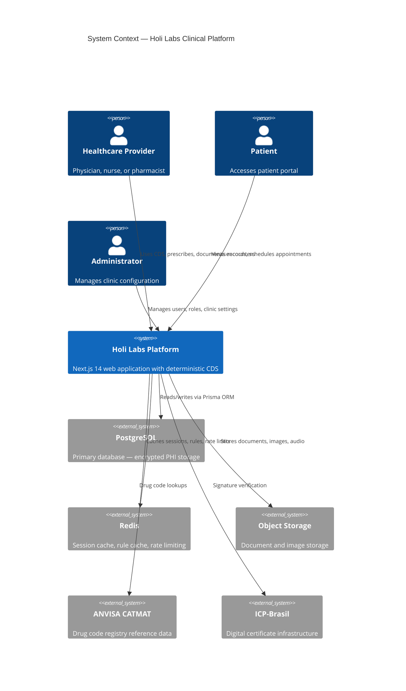
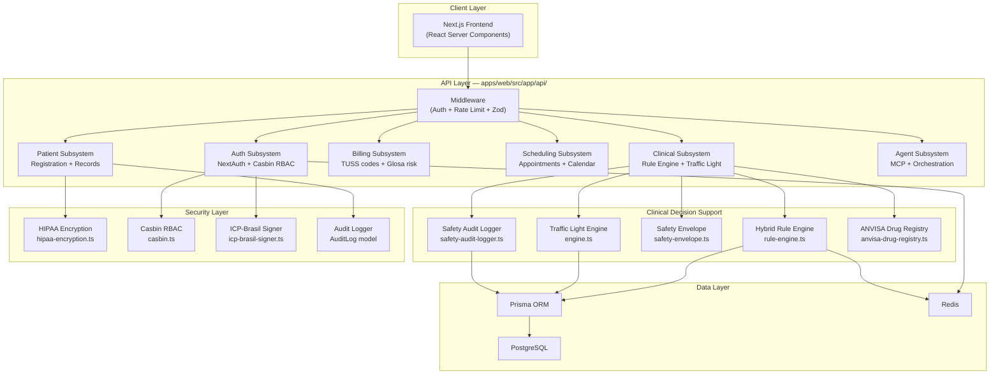
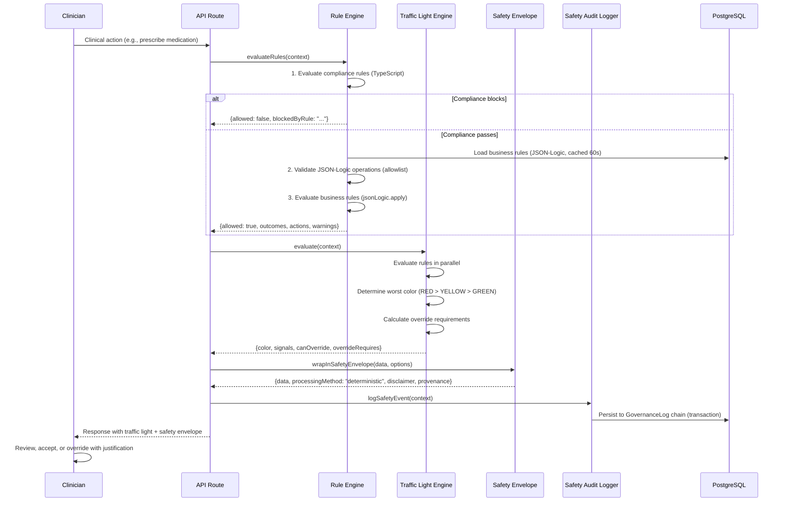
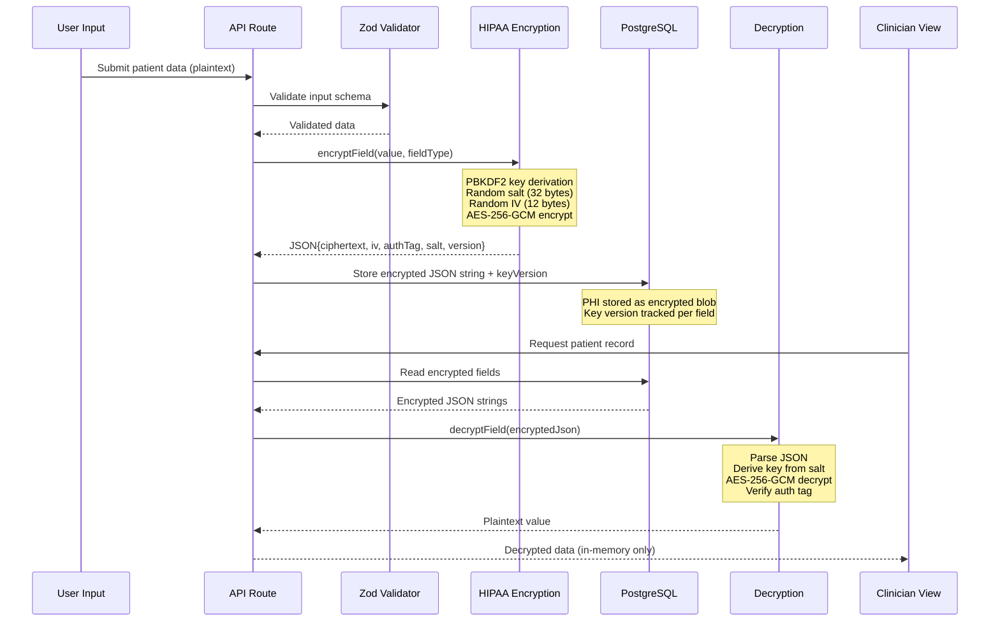
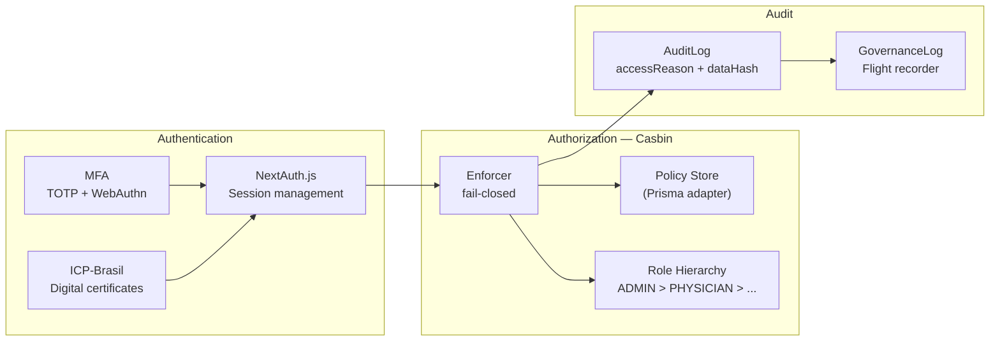

# Software Architecture Description

**Document ID:** SAD-HHL-001  
**IEC 62304 Reference:** Clause 5.3 — Software Architectural Design  
**Safety Classification:** Class A  
**Version:** 1.0  
**Date:** 2026-04-04  
**Author:** Holi Labs Engineering  
**Status:** Draft — Pending QA Review

---

## 1. System Context

The Holi Labs Clinical Platform operates as a cloud-hosted web application serving Brazilian healthcare providers. The system integrates with external services for storage, caching, and national health infrastructure.

### 1.1 System Context Diagram

---

## 2. Component Architecture

### 2.1 High-Level Component Diagram

### 2.2 Subsystem Descriptions

| Subsystem | Location | Responsibility |
|-----------|----------|---------------|
| **Auth** | `apps/web/src/lib/auth/` | Authentication (NextAuth), authorization (Casbin RBAC), MFA, WebAuthn, ICP-Brasil signatures |
| **Clinical** | `apps/web/src/lib/clinical/` | Rule engine, safety envelope, audit logging, compliance rules |
| **Traffic Light** | `apps/web/src/lib/traffic-light/` | Unified CDS evaluation (clinical + billing + administrative rules) |
| **Security** | `apps/web/src/lib/security/` | PHI encryption (AES-256-GCM), key rotation, searchable hashes |
| **Brazil Interop** | `apps/web/src/lib/brazil-interop/` | ANVISA drug codes (CATMAT), controlled substance classification |
| **Billing** | `apps/web/src/lib/finance/` | TUSS code validation, ICD-10 mapping, glosa risk estimation |
| **Scheduling** | `apps/web/src/app/api/appointments/` | Appointment CRUD, calendar integration, waitlist management |
| **Patient** | `apps/web/src/app/api/patients/` | Patient registration, record access, LGPD data rights |
| **Agent** | `apps/web/src/app/api/agent/` | MCP agent orchestration, tool capabilities, event processing |

---

## 3. Clinical Decision Support Architecture

The CDS is the safety-critical component of the system. Its architecture is designed to ensure determinism, transparency, and clinician override at every step.

### 3.1 CDS Data Flow

### 3.2 Determinism Guarantees

| Layer | Mechanism | File Reference |
|-------|-----------|---------------|
| Compliance rules | TypeScript functions — compiled, immutable | `apps/web/src/lib/clinical/compliance-rules.ts` |
| Business rules | JSON-Logic with strict operation allowlist | `rule-engine.ts` lines 40–51 |
| Operation validation | Recursive allowlist check before execution | `rule-engine.ts` function `validateJsonLogicOperations()` |
| Traffic light | Color priority constant map, no randomness | `engine.ts` lines 57–62 |
| Override logic | Deterministic severity → requirement mapping | `engine.ts` lines 478–506 |

**Disallowed operations** (blocked by `validateJsonLogicOperations()`): `log`, `method`, `throw`, and any custom operations. Only safe, side-effect-free operations are permitted.

---

## 4. PHI Data Flow Architecture

### 4.1 Encryption Flow

### 4.2 Key Rotation

Key rotation is supported via the `rotateEncryption()` function (`hipaa-encryption.ts` lines 263–301):
1. Decrypt with old key
2. Generate new salt and IV
3. Re-encrypt with new key
4. Increment version number

Key versions are tracked per field in the Prisma schema (e.g., `firstNameKeyVersion`, `emailKeyVersion`).

---

## 5. Security Architecture

### 5.1 Authentication & Authorization

### 5.2 RBAC Role Hierarchy

| Role | Inherits From | Key Permissions |
|------|--------------|-----------------|
| ADMIN | PHYSICIAN | Full system access + user management |
| PHYSICIAN | — | Patient CRUD, prescriptions, consultations, lab results |
| CLINICIAN | — | Patient read/write, consultations, prescription read |
| NURSE | — | Patient read, consultations read, prescriptions read, lab results read |
| RECEPTIONIST | — | Patient read/write, appointments CRUD |
| LAB_TECH | — | Patient read, lab results read/write |
| PHARMACIST | — | Patient read, prescriptions read/write |
| STAFF | — | Patient read only |

Reference: `casbin.ts` function `initializeDefaultPolicies()` lines 575–638.

### 5.3 Data Classification

| Level | Label | Handling | Examples |
|-------|-------|----------|----------|
| L1 | PUBLIC | No restrictions | Marketing content, public docs |
| L2 | INTERNAL | No external sharing | Internal metrics, workspace metadata |
| L3 | CONFIDENTIAL | Encrypted + audit logged | Billing, API keys, credentials |
| L4 | PHI | AES-256-GCM + audit + consent-gated | Patient names, CPF, CNS, clinical notes |

Reference: `.claude/rules/security.md` — Data Classification.

---

## 6. Deployment Architecture

| Component | Technology | Configuration |
|-----------|-----------|--------------|
| Application | Next.js 14 (Docker) | `Dockerfile.prod` |
| Database | PostgreSQL 15+ | Managed service with encryption at rest |
| Cache | Redis 7+ | Session store, rule cache |
| Object Storage | S3-compatible | Document and image storage |
| CI/CD | GitHub Actions | `.github/workflows/ci.yml`, `deploy.yml` |
| Monitoring | Structured logging | JSON log format with event codes |

---

## 7. Software of Unknown Provenance (SOUP)

| Component | Version | Purpose | Risk Mitigation |
|-----------|---------|---------|-----------------|
| Next.js | 14.x | Web framework | Pinned version, automated security scanning |
| Prisma | Latest | ORM | Parameterized queries prevent SQL injection |
| json-logic-js | Latest | Deterministic rule evaluation | Operation allowlist (REQ-CLIN-003) |
| casbin | Latest | RBAC policy engine | Fail-closed design (REQ-SEC-004) |
| @simplewebauthn | v13 | WebAuthn biometric auth | FIDO2 standard implementation |
| node:crypto | Built-in | AES-256-GCM, PBKDF2 | Node.js LTS, NIST-approved algorithms |

---

## Revision History

| Version | Date | Author | Description |
|---------|------|--------|-------------|
| 1.0 | 2026-04-04 | Holi Labs Engineering | Initial release for ANVISA Class I notification |
