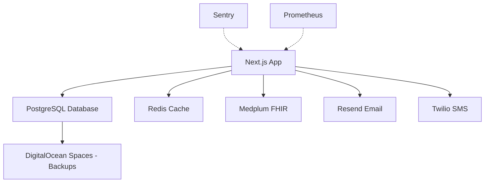

# Disaster Recovery Plan (DRP)
**Organization:** HOLI Labs Healthcare Platform
**Version:** 1.0
**Last Updated:** 2026-01-02
**Review Frequency:** Quarterly
**Owner:** Security & Operations Team

---

## Executive Summary

This Disaster Recovery Plan defines procedures for recovering critical systems and data in the event of catastrophic failure. The plan is designed to meet LGPD Art. 48 (Security Incident Response) and ensure continuity of patient care operations.

**Recovery Objectives:**
- **RTO (Recovery Time Objective):** < 1 hour
- **RPO (Recovery Point Objective):** < 15 minutes
- **Maximum Tolerable Downtime:** 4 hours
- **Data Loss Tolerance:** 0 patient records (zero PHI data loss)

---

## Table of Contents

1. [Disaster Scenarios](#disaster-scenarios)
2. [Pre-Disaster Preparation](#pre-disaster-preparation)
3. [Recovery Procedures](#recovery-procedures)
4. [Testing & Validation](#testing--validation)
5. [Communication Plan](#communication-plan)
6. [Post-Recovery Actions](#post-recovery-actions)

---

## Disaster Scenarios

### Scenario 1: Database Corruption/Failure ⚠️ CRITICAL

**Impact:** Complete loss of access to patient data  
**Severity:** P1 - Critical  
**Estimated Frequency:** Once per 2-5 years

**Causes:**
- Hardware failure (disk corruption)
- Software bug (PostgreSQL crash)
- Human error (accidental DROP TABLE)
- Data corruption (bit rot, memory errors)

**Detection:**
- Application errors: "database connection failed"
- Prometheus alert: `DatabaseDown`
- Health check failures: `/api/health` returns 500
- Sentry: Database connection exceptions

**Recovery Procedure:** [See Database Recovery](#database-recovery-procedure)

---

### Scenario 2: Complete Infrastructure Outage ⚠️ CRITICAL

**Impact:** All services unavailable (web, API, database)  
**Severity:** P1 - Critical  
**Estimated Frequency:** Once per 5-10 years

**Causes:**
- DigitalOcean datacenter outage
- DDoS attack
- Network infrastructure failure
- Accidental resource deletion

**Detection:**
- All services unreachable
- Prometheus: All targets down
- PagerDuty: Multiple alerts firing
- User reports: "Site is down"

**Recovery Procedure:** [See Infrastructure Recovery](#infrastructure-recovery-procedure)

---

### Scenario 3: Application Deployment Failure 🟡 HIGH

**Impact:** New deployment breaks production  
**Severity:** P2 - High  
**Estimated Frequency:** 1-2 times per year

**Causes:**
- Breaking code changes
- Database migration failure
- Environment variable misconfiguration
- Dependency conflicts

**Detection:**
- Elevated error rates (Sentry spike)
- Health check failures
- User reports of bugs/errors
- Failed CI/CD deployment

**Recovery Procedure:** [See Rollback Procedure](#rollback-procedure)

---

### Scenario 4: Data Breach / Ransomware 🔴 CRITICAL

**Impact:** PHI exposure, regulatory violation  
**Severity:** P1 - Critical + Legal  
**Estimated Frequency:** Low (with proper security)

**Causes:**
- Compromised credentials
- SQL injection vulnerability
- Insider threat
- Ransomware attack

**Detection:**
- Unusual audit log patterns
- Sentry: Suspicious database queries
- Failed authentication spike
- Security scanner alerts

**Recovery Procedure:** [See Security Incident Response](#security-incident-response)

---

### Scenario 5: Accidental Data Deletion 🟡 HIGH

**Impact:** Loss of patient records (1-100 records)  
**Severity:** P2 - High + Regulatory  
**Estimated Frequency:** Once per 1-2 years

**Causes:**
- User error (bulk delete)
- Software bug (cascade delete)
- API misconfiguration

**Detection:**
- User report: "Patient missing"
- Audit log: Bulk DELETE operations
- Metrics: Sudden drop in patient count

**Recovery Procedure:** [See Point-in-Time Recovery](#point-in-time-recovery)

---

## Pre-Disaster Preparation

### 1. Backup Strategy ✅

**Daily Automated Backups:**
- **Method:** DigitalOcean Managed Database daily snapshots
- **Schedule:** 2:00 AM BRT (lowest traffic period)
- **Retention:** 30 days rolling window
- **Location:** DigitalOcean Spaces (S3-compatible) - `sfo3` region
- **Encryption:** AES-256 at rest

**Continuous WAL Archiving:**
- **Method:** PostgreSQL Write-Ahead Logging (WAL) - Managed by DigitalOcean
- **RPO:** < 5 minutes (WAL backups every 5 minutes automatically)
- **Archive Location:** Managed by DigitalOcean (transparent to user)
- **Retention:** 30 days (matches backup retention)

**Point-in-Time Recovery (PITR):** Enabled automatically via DigitalOcean's managed database service. See `docs/WAL_ARCHIVING_PITR.md` for detailed procedures.

**Configuration:** No manual configuration required - fully managed by DigitalOcean

**Verification:**
```bash
# List recent backups
doctl databases backup list $PRODUCTION_DB_ID

# Expected: At least 30 backups (daily for 1 month)
```

---

### 2. Infrastructure as Code (IaC)

**Docker Configuration:**
- `Dockerfile` - Application container
- `docker-compose.yml` - Local development
- `docker-compose.prod.yml` - Production stack

**Monitoring:**
- `infra/monitoring/prometheus.yml` - Metrics collection
- `infra/monitoring/prometheus-alerts.yaml` - Alert rules
- `infra/monitoring/grafana-dashboards/` - Visualization

**Restoration:**
All infrastructure can be rebuilt from Git repository. No manual configuration required.

---

### 3. Access & Credentials

**Required Credentials for Disaster Recovery:**

| Service | Credential | Location | Owner |
|---------|------------|----------|-------|
| DigitalOcean | Access Token | GitHub Secrets | DevOps Lead |
| Database | Connection URL | 1Password Vault | DBA |
| S3 Backup | Access Key | 1Password Vault | DevOps Lead |
| PagerDuty | API Key | 1Password Vault | On-Call Lead |
| Sentry | Auth Token | GitHub Secrets | DevOps Lead |

**Access Verification:**
```bash
# Test DigitalOcean CLI
doctl auth list

# Test database connection
psql $DATABASE_URL -c "SELECT 1"

# Test S3 access
aws s3 ls s3://holi-db-backups/
```

---

### 4. Communication Channels

**Primary:** PagerDuty → Slack #incidents  
**Secondary:** Email → ops@holilabs.com  
**Emergency:** SMS → On-call rotation

**Status Page:** status.holilabs.com (StatusPage.io)

---

## Recovery Procedures

### Database Recovery Procedure

**Recovery Time Objective:** < 1 hour  
**Recovery Point Objective:** < 15 minutes

#### Step 1: Assess Damage (0-5 minutes)

```bash
# Check database status
doctl databases get $PRODUCTION_DB_ID

# Check connection
psql $DATABASE_URL -c "SELECT COUNT(*) FROM \"Patient\""

# Check audit logs for corruption source
psql $DATABASE_URL -c "SELECT * FROM audit_logs ORDER BY created_at DESC LIMIT 100"
```

#### Step 2: Identify Recovery Point (5-10 minutes)

```bash
# List available backups
doctl databases backup list $PRODUCTION_DB_ID

# Get latest backup details
LATEST_BACKUP_ID=$(doctl databases backup list $PRODUCTION_DB_ID --format ID --no-header | head -n1)
doctl databases backup get $PRODUCTION_DB_ID $LATEST_BACKUP_ID
```

**Decision Tree:**
- **Full corruption:** Use latest backup (fork via doctl)
- **Partial corruption:** Use point-in-time recovery (PITR) via database fork - see `docs/WAL_ARCHIVING_PITR.md`
- **Accidental deletion:** Use PITR to restore to time before deletion (RPO: < 5 minutes) - see `docs/WAL_ARCHIVING_PITR.md#scenario-3-accidental-data-deletion`

**PITR Example:**
```bash
# Fork database to specific point in time (before corruption/deletion)
doctl databases fork $PRODUCTION_DB_ID holi-recovery-$(date +%s) \
  --restore-from-timestamp "2026-01-03T10:15:00Z"
```
See full PITR procedures in `docs/WAL_ARCHIVING_PITR.md`

#### Step 3: Execute Restore (10-60 minutes)

```bash
# Run automated restore script
./scripts/restore-database.sh $BACKUP_ID production
```

**Script performs:**
1. Pre-restore checks (doctl auth, backup verification)
2. Creates safety backup of current state
3. Stops application (prevents writes)
4. Restores from backup (15-45 min depending on size)
5. Verifies data integrity
6. Restarts application

**Manual Steps** (if automated script unavailable):

```bash
# 1. Create safety backup
doctl databases backup create $PRODUCTION_DB_ID

# 2. Stop application
doctl apps update $PRODUCTION_APP_ID --spec .do/app.yaml --force-rebuild

# 3. Restore via DigitalOcean Console
# Go to: Databases → $PRODUCTION_DB_ID → Backups → Restore

# 4. Verify restoration
psql $NEW_DATABASE_URL -c "SELECT COUNT(*) FROM \"Patient\""

# 5. Update DATABASE_URL env var
doctl apps update $PRODUCTION_APP_ID --env DATABASE_URL=$NEW_DATABASE_URL

# 6. Restart application
doctl apps create-deployment $PRODUCTION_APP_ID
```

#### Step 4: Verify Recovery (60-70 minutes)

```bash
# Health check
curl https://app.holilabs.com/api/health

# Smoke tests
./scripts/smoke-test.sh production

# Check recent data
psql $DATABASE_URL -c "
SELECT COUNT(*) as total_patients,
       MAX(created_at) as most_recent_patient
FROM \"Patient\""

# Verify audit logs
psql $DATABASE_URL -c "
SELECT COUNT(*) as total_audit_logs,
       MAX(created_at) as most_recent_audit
FROM audit_logs"
```

#### Step 5: Monitor (70-120 minutes)

- Watch Grafana dashboards for anomalies
- Monitor Sentry for errors
- Check Prometheus alerts
- Review first 10 user sessions

---

### Infrastructure Recovery Procedure

**Recovery Time Objective:** < 2 hours  
**Recovery Point Objective:** < 15 minutes (data), 0 minutes (infrastructure)

#### Step 1: Assess Scope (0-10 minutes)

```bash
# Check DigitalOcean status
curl https://status.digitalocean.com/api/v2/status.json

# Check app status
doctl apps list

# Check database status
doctl databases list

# Check droplets (if using)
doctl compute droplet list
```

#### Step 2: Redeploy Infrastructure (10-60 minutes)

**Option A: Rebuild from Git (Recommended)**

```bash
# 1. Clone repository
git clone https://github.com/holilabs/holilabsv2
cd holilabsv2

# 2. Deploy to DigitalOcean
git push production main

# Triggers: .github/workflows/deploy-production.yml
```

**Option B: Manual Deployment**

```bash
# 1. Create new DigitalOcean App
doctl apps create --spec .do/app.yaml

# 2. Create new database (if needed)
doctl databases create holi-labs-prod \
  --engine pg \
  --version 15 \
  --region sfo3 \
  --size db-s-2vcpu-4gb \
  --num-nodes 1

# 3. Restore database from backup
./scripts/restore-database.sh latest production

# 4. Update app environment variables
doctl apps update $NEW_APP_ID --env DATABASE_URL=$NEW_DATABASE_URL

# 5. Deploy
doctl apps create-deployment $NEW_APP_ID
```

#### Step 3: Verify Recovery (60-80 minutes)

```bash
# Run full test suite
pnpm test

# Run E2E tests
pnpm test:e2e

# Manual verification checklist
- [ ] Homepage loads
- [ ] User can log in
- [ ] Patient list loads
- [ ] Create new patient works
- [ ] Prescriptions load
- [ ] Appointments visible
```

---

### Rollback Procedure

**Recovery Time Objective:** < 15 minutes  
**Use Case:** Bad deployment, application errors

#### Quick Rollback (Fastest)

```bash
# Option 1: Rollback via DigitalOcean Console
# Go to: Apps → $PRODUCTION_APP_ID → Deployments → Previous Deployment → "Rollback"

# Option 2: Rollback via CLI
PREVIOUS_DEPLOYMENT_ID=$(doctl apps list-deployments $PRODUCTION_APP_ID --format ID --no-header | sed -n '2p')
doctl apps create-deployment $PRODUCTION_APP_ID --deployment-id $PREVIOUS_DEPLOYMENT_ID
```

#### Git Revert Rollback

```bash
# 1. Revert problematic commit
git revert $BAD_COMMIT_SHA
git push origin main

# 2. Redeploy
git push production main

# CI/CD will automatically deploy reverted version
```

#### Database Migration Rollback

```bash
# 1. Check migration status
cd apps/web && pnpm prisma migrate status

# 2. Rollback last migration
cd apps/web && pnpm prisma migrate resolve --rolled-back $MIGRATION_NAME

# 3. Apply corrected migration
cd apps/web && pnpm prisma migrate deploy
```

---

### Point-in-Time Recovery (PITR)

**Use Case:** Accidental data deletion, need to recover to specific timestamp

**Requirements:**
- WAL archiving enabled (configured)
- Recovery timestamp known (from audit logs)
- S3 bucket with WAL archives accessible

#### Procedure

```bash
# 1. Find deletion timestamp from audit logs
psql $DATABASE_URL -c "
SELECT * FROM audit_logs
WHERE action = 'DELETE'
  AND resource = 'Patient'
  AND created_at > NOW() - INTERVAL '7 days'
ORDER BY created_at DESC"

# Example: Patient deleted at 2026-01-02 14:35:22

# 2. Create test database for PITR
doctl databases create holi-labs-pitr \
  --engine pg \
  --version 15 \
  --region sfo3 \
  --size db-s-2vcpu-4gb \
  --num-nodes 1

# 3. Restore base backup (most recent before deletion)
./scripts/restore-database.sh $BACKUP_ID test-restore

# 4. Apply WAL files to recover to exact timestamp
# (Requires PostgreSQL recovery.conf - see PostgreSQL docs)
cat > recovery.conf <<EOF
restore_command = 'aws s3 cp s3://holi-db-wal-archive/%f %p'
recovery_target_time = '2026-01-02 14:35:00'
recovery_target_action = 'promote'
EOF

# 5. Extract deleted records
psql $PITR_DATABASE_URL -c "
COPY (SELECT * FROM \"Patient\" WHERE id = '$DELETED_PATIENT_ID')
TO '/tmp/recovered-patient.csv' CSV HEADER"

# 6. Restore to production
psql $DATABASE_URL -c "
COPY \"Patient\" FROM '/tmp/recovered-patient.csv' CSV HEADER"

# 7. Verify restoration
psql $DATABASE_URL -c "SELECT * FROM \"Patient\" WHERE id = '$DELETED_PATIENT_ID'"
```

---

### Security Incident Response

**See:** `/docs/runbooks/SECURITY_INCIDENT.md` (Comprehensive security incident plan)

**Quick Reference:**

#### Immediate Actions (0-15 minutes)

1. **Isolate Affected Systems**
   ```bash
   # Revoke compromised credentials
   doctl apps update $PRODUCTION_APP_ID --env API_KEY=NEW_SECURE_KEY
   
   # Block suspicious IPs
   # (Configure WAF rules in DigitalOcean)
   ```

2. **Stop Data Exfiltration**
   ```bash
   # Check audit logs for unauthorized access
   psql $DATABASE_URL -c "
   SELECT * FROM audit_logs
   WHERE success = false
     OR action = 'BREAK_GLASS_ACCESS'
   ORDER BY created_at DESC
   LIMIT 100"
   ```

3. **Notify Stakeholders**
   - Security team
   - Legal counsel
   - Regulatory authorities (if breach confirmed)

#### Investigation (15-120 minutes)

- Review Sentry error logs
- Analyze Prometheus metrics for anomalies
- Check audit logs for unauthorized PHI access
- Preserve evidence (snapshot database, save logs)

#### Breach Determination (LGPD Art. 48)

**PHI Breach = YES if:**
- Unauthorized access to patient records (audit logs show access by non-authorized user)
- Data exfiltration confirmed (export logs, network traffic)
- Encryption keys compromised

**Required Actions:**
- **Brazil (LGPD Art. 48):** Notify ANPD within "reasonable time" + affected patients
- **Argentina (PDPA Art. 32):** Notify AAIP within 72 hours
- **US (HIPAA Breach):** Notify HHS + patients within 60 days (if applicable)

#### Recovery Actions

```bash
# 1. Rotate all secrets
./scripts/rotate-secrets.sh

# 2. Force password reset for all users
psql $DATABASE_URL -c "UPDATE \"User\" SET must_change_password = true"

# 3. Audit all access grants
psql $DATABASE_URL -c "
SELECT * FROM \"DataAccessGrant\"
WHERE revoked_at IS NULL
  AND (expires_at IS NULL OR expires_at > NOW())"

# 4. Review and revoke suspicious grants
psql $DATABASE_URL -c "
UPDATE \"DataAccessGrant\"
SET revoked_at = NOW()
WHERE id IN (SELECT id FROM suspicious_grants)"
```

---

## Testing & Validation

### Quarterly Disaster Recovery Drills

**Schedule:** First Monday of each quarter  
**Duration:** 2-4 hours  
**Participants:** DevOps, Security, On-Call Engineers

#### Test 1: Database Restore (Q1, Q3)

```bash
# Restore to staging from production backup
./scripts/restore-database.sh latest staging

# Verify data integrity
./scripts/verify-restore.sh staging

# Time the operation (should be < 1 hour)
```

#### Test 2: Full Infrastructure Rebuild (Q2, Q4)

```bash
# Delete staging app
doctl apps delete $STAGING_APP_ID

# Rebuild from scratch
git push staging main

# Verify functionality
pnpm test:e2e --env=staging
```

#### Test 3: Fire Drill Incident Response (Quarterly)

Simulate a P1 incident:
1. PagerDuty alert sent to on-call engineer
2. Engineer follows runbook
3. Incident commander coordinates response
4. Post-incident review

**Success Criteria:**
- [ ] On-call acknowledges within 5 minutes
- [ ] Incident commander identified within 10 minutes
- [ ] Status page updated within 15 minutes
- [ ] Recovery initiated within 30 minutes
- [ ] Post-mortem completed within 24 hours

---

## Communication Plan

### Internal Communication

**Incident Chat:** Slack #incidents (real-time coordination)  
**Escalation:** PagerDuty → On-Call Engineer → Engineering Manager → CTO

**Incident Severity:**
- **P1 (Critical):** Page immediately (5-minute SLA)
- **P2 (High):** Slack alert (15-minute SLA)
- **P3 (Medium):** Email notification (1-hour SLA)
- **P4 (Low):** Ticket created (next business day)

### External Communication

**Status Page:** status.holilabs.com  
**Patient Notification:** Email via Resend, SMS via Twilio

**Templates:**

#### During Incident
```
🟡 INVESTIGATING: We are currently investigating an issue affecting the HOLI Labs platform.
Estimated resolution: [TIME]
Updates will be posted every 30 minutes.
```

#### Resolved
```
✅ RESOLVED: The incident has been resolved. All systems are operational.
Root cause: [BRIEF EXPLANATION]
Post-mortem: [LINK] (published within 24 hours)
```

#### PHI Breach Notification (LGPD Art. 48)
```
URGENT: Data Security Incident Notification

Dear [Patient Name],

We are writing to inform you of a security incident that may have affected your
personal health information. On [DATE], we discovered [INCIDENT DESCRIPTION].

Information Potentially Affected:
- [LIST OF DATA TYPES]

Actions We Have Taken:
- [MITIGATION STEPS]

Actions You Should Take:
- [PATIENT RECOMMENDATIONS]

Contact: security@holilabs.com | +55 11 XXXX-XXXX
```

---

## Post-Recovery Actions

### Immediate Post-Recovery (0-4 hours)

1. **Verify System Stability**
   - Monitor error rates for 4 hours
   - Check all critical workflows (login, patient creation, prescriptions)
   - Review audit logs for anomalies

2. **Update Status Page**
   - Mark incident as resolved
   - Post preliminary summary
   - Promise full post-mortem in 24 hours

3. **Preserve Evidence**
   - Save all logs to S3: `s3://holi-incident-logs/incident-YYYY-MM-DD/`
   - Screenshot Grafana dashboards
   - Export relevant audit logs
   - Save PagerDuty incident timeline

### Post-Mortem (24 hours)

**Template:** `/docs/templates/post-mortem-template.md`

**Required Sections:**
1. **Incident Summary** (what happened, impact, duration)
2. **Timeline** (detailed chronology)
3. **Root Cause** (technical analysis)
4. **Impact Assessment** (users affected, data loss, revenue impact)
5. **What Went Well** (positive aspects of response)
6. **What Went Wrong** (gaps, mistakes, delays)
7. **Action Items** (prevent recurrence)

**Publish:** Confluence, share with engineering team

### Follow-Up Actions (1 week)

1. **Update Runbooks** (incorporate lessons learned)
2. **Implement Action Items** (create Jira tickets)
3. **Schedule Drill** (practice response to similar scenario)
4. **Regulatory Reporting** (if required by LGPD/PDPA)

---

## Appendices

### Appendix A: Contact List

| Role | Name | Primary Phone | Secondary Email | PagerDuty |
|------|------|---------------|-----------------|-----------|
| On-Call Engineer | Rotation | (via PagerDuty) | oncall@holilabs.com | @on-call |
| Engineering Manager | TBD | +55 11 XXXX-XXXX | eng-lead@holilabs.com | @eng-lead |
| CTO | TBD | +55 11 XXXX-XXXX | cto@holilabs.com | @cto |
| Security Lead | TBD | +55 11 XXXX-XXXX | security@holilabs.com | @security |
| Legal Counsel | TBD | +55 11 XXXX-XXXX | legal@holilabs.com | - |

### Appendix B: Service Dependencies



**Critical Path:** App → Database (all other services degrade gracefully)

### Appendix C: Backup Inventory

| Backup Type | Location | Retention | Encryption | Frequency |
|-------------|----------|-----------|------------|-----------|
| Full DB Snapshot | DO Spaces | 30 days | AES-256 | Daily 2AM BRT |
| WAL Archives | S3 | 7 days | AES-256 | Continuous |
| Application Logs | S3 | 6 years | AES-256 | Real-time |
| Audit Logs | PostgreSQL | 6 years | AES-256 | Real-time |
| Docker Images | DO Registry | 90 days | N/A | Per deployment |

### Appendix D: Recovery Time Matrix

| Scenario | RTO | RPO | Data Loss Risk |
|----------|-----|-----|----------------|
| Database Corruption | < 1 hour | < 15 min | Low |
| Infrastructure Outage | < 2 hours | 0 (infra), < 15 min (data) | Low |
| Bad Deployment | < 15 min | 0 | None |
| Data Deletion | < 1 hour | 0 (PITR) | None |
| Security Breach | Varies | N/A | Medium-High |

---

## Document Control

**Version History:**

| Version | Date | Author | Changes |
|---------|------|--------|---------|
| 1.0 | 2026-01-02 | DevOps Team | Initial version |

**Review Schedule:**
- **Quarterly:** Full plan review
- **Post-Incident:** Update within 48 hours
- **Annually:** Full disaster recovery drill

**Next Review Date:** 2026-04-01

---

**For assistance during an incident:**
- **Emergency Hotline:** PagerDuty (automatic escalation)
- **Slack:** #incidents channel
- **Email:** oncall@holilabs.com

**Remember:** Stay calm, follow the runbook, communicate clearly, document everything.
